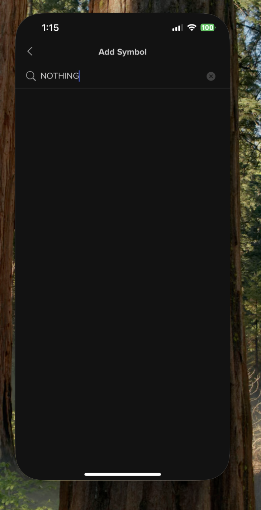
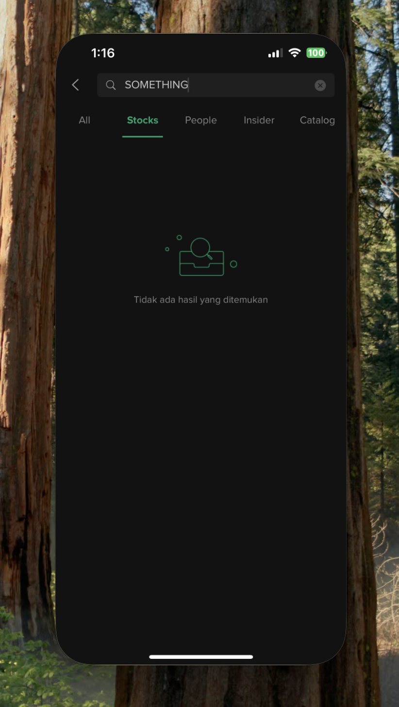
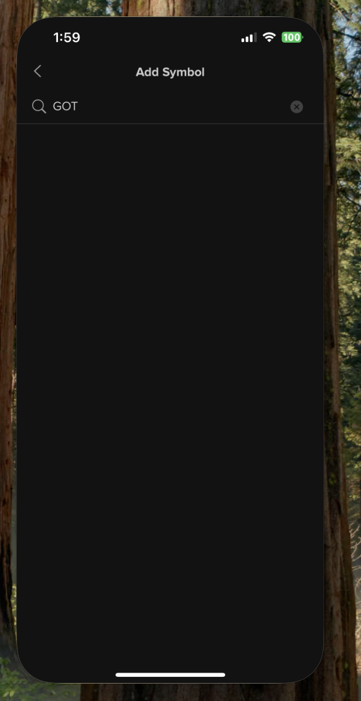
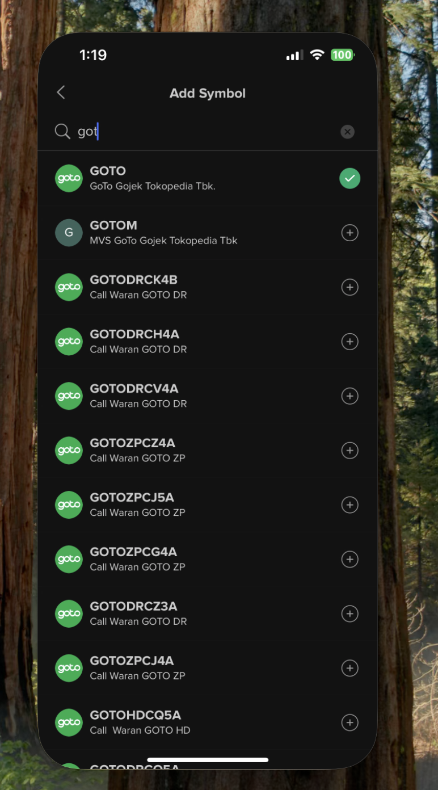
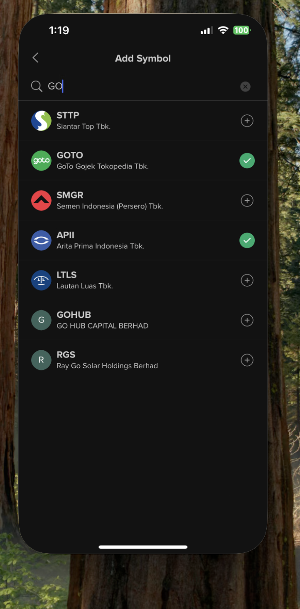
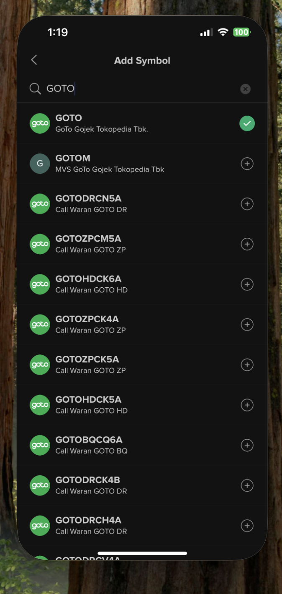

# Stockbit QA Technical Test - Task 3: Bug/Bad Journey Report

## Bug Report ID: SB-BUG-001

### Title: "Add Symbol" Search Fails to Display "No Results Found" Message

**Feature Area:** Watchlist Management (Add Symbol Search Bar)
**Platform:** IOS App
**App Version:** v3.16.1(38383)
**Severity:** **Medium**

---

### Description / User Journey

When a user attempts to search for a stock symbol in the "Add Symbol" screen and the query returns no results, the screen remains completely blank. There is no message or text indicating that the search was unsuccessful, leading the user to believe the app is frozen or the search is still loading. This differs from the main search experience.

### Steps to Reproduce (STR)

1. Navigate to the **Watchlist** tab (Homepage).
2. Tap the **Add button** (usually the plus icon `+`).
3. Enter a nonexistent or nonsensical search term (e.g., **"NOTHING"**).
4. Observe the search results area.

### Expected Result

The search results area should display a clear and helpful message, such as: **"No results found for 'NOTHING'."** 

### Actual Result (The Bug)

The search results area turns **completely blank**. No error or indication message is displayed to the user.

### Evidence

***

## Bug Report ID: SB-BUG-002

### Title: "Add Symbol" Search is Case-Sensitive and Fails for Partial/Capitalized Symbols

**Feature Area:** Watchlist Management (Add Symbol Search Bar)
**Platform:** IOS App
**App Version:** v3.16.1(38383)
**Severity:** **High**

---

### Description / User Journey

The search function on the "Add Symbol" screen exhibits restrictive behaviour regarding case sensitivity and partial matching. Specifically, entering a partial term with an initial capital letter (e.g., "Got" or "GOT" for "GOTO") results in a blank screen, while entering the same term in full lowercase ("goto" or "got") or full uppercase ("GOTO") works correctly. This lack of case-insensitivity significantly hinders the user's ability to quickly find stocks.

### Steps to Reproduce (STR)

1. Navigate to the **Watchlist** tab.
2. Tap the **Add button** > Tap **"Search Symbol"**.
3. **Failing Case:** Enter a partial, capitalized term (e.g., **`Got`** or **`GOT`**).
4. **Successful Case (for comparison):** Enter the same partial term in all lowercase (e.g., **`got`**).

### Expected Result

The search should be **case-insensitive** and display results for terms like **GOTO** regardless of whether the user enters **`Got`**, **`GOT`**, or **`got`**.

### Actual Result (The Bug)

When entering the partial, capitalized terms **`Got`** or **`GOT`**, **no results are displayed** (the screen is blank). Only the fully correct (e.g., **GOTO**) or fully lowercase (e.g., **goto or got**) terms yield results.

### Evidence

**Failing Case (Blank Screen):**

**Working Cases (Shows Results):**

